## Sobre mim

Desenvolvedor de software sênior com mais de **8 anos de experiência** em soluções web e mobile, do banco de dados à interface: APIs, integrações, microsserviços, frontend e apps.

Já trabalhei com e-commerce, sistemas empresariais, plataformas de autoatendimento, integrações com CRMs e ERPs, logística e aplicações com inteligência artificial.

## Projetos e experiências

- **[ArchPrompts](https://arch-prompts.com/)** — marketplace de prompts para arquitetura de sistemas
- **E-commerce de alto tráfego** com React, VTEX IO e GraphQL
- **Portais e aplicativos mobile** para atendimento e serviços digitais
- **APIs de integração** entre CRMs, ERPs e sistemas corporativos
- **Microsserviços administrativos e logísticos** com FastAPI e RabbitMQ
- **Chatbots e autoatendimento inteligente** com NLP
- **Aplicações offline**, biometria e integração com dispositivos

Outros trabalhos no meu [portfólio](https://pacheco.dev.br).

## Contato

[pacheco.dev.br](https://pacheco.dev.br) · [LinkedIn](https://www.linkedin.com/in/pacheco-dev-br/) · [pacheco.code@gmail.com](mailto:pacheco.code@gmail.com)

O card é gerado por <a href="./tools/gen_card.py"><code>tools/gen_card.py</code></a>.
